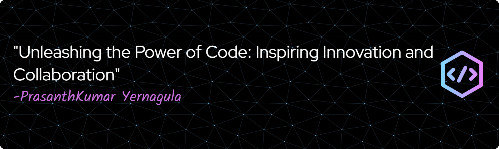

<h1 align="center">Prasanthkumar Yernagula</h1>
<h3 align="center">Associate Technical Consultant · SAP S/4HANA · Independent AI Researcher</h3>

  
  
  

---

### About

Associate Technical Consultant at **msg global solutions**, working within the SAP S/4HANA Insurance – Reinsurance domain. I design and build Fiori UX, CDS Views, and OData services, and have developed AI prototypes integrated directly into SAP S/4 Reinsurance processes.

Outside of consulting, I research on-device AI — specifically whether small language models can replace cloud LLM calls inside enterprise environments where data regulations prohibit external APIs. My current work benchmarks sub-4B models on NL-to-OData translation using only schema injection, with no fine-tuning.

I also founded **PK eLibrary** — a non-profit that started as a Telegram chatbot in college and has now delivered over **1 million PDFs** to students across India. My technical content across platforms has crossed **1.7 million views**.

---

### What I'm Working On

- 🔬 &nbsp;**NL2OData Research** — on-device LLM query translation for SAP Fiori, no fine-tuning
- 🏢 &nbsp;**SAP S/4HANA Insurance** — consulting on Reinsurance processes at msg global solutions
- 📚 &nbsp;**PK eLibrary** — scaling the study-material platform to serve more student communities

---

### Tech Stack

**SAP & Enterprise**

**AI / ML**

**Web & Languages**

**Tools & Data**

---

### Community & Leadership

| Role | Organisation | Impact |
|---|---|---|
| **Founder** | PK eLibrary | 1M+ PDFs delivered · non-profit study material platform |
| **Google DSC Lead** | SVCE Tirupati · Google-backed | Inaugural lead · workshops · developer community |
| **President** | Coding Club, SVCE | Dec 2022 – Mar 2024 |
| **HackerEarth Campus Ambassador** | HackerEarth | Dec 2022 – Jul 2023 |
| **Technical Resource Person** | AMPLE 2K23 (national symposium) | ML & Chatbot track · 4.9 / 5 rating |
| **Content Creator** | Blogs · Social | 1.7M+ views across platforms |

---

### GitHub Stats

  
  

  

---

### Connect

📫 &nbsp;**prashanthcse2024@gmail.com** &nbsp;·&nbsp; 🌐 &nbsp;[prasanthkumar.tech](https://prasanthkumar.tech)
